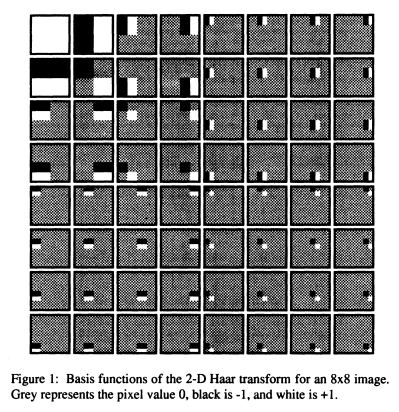
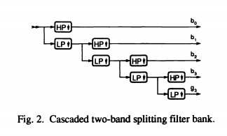
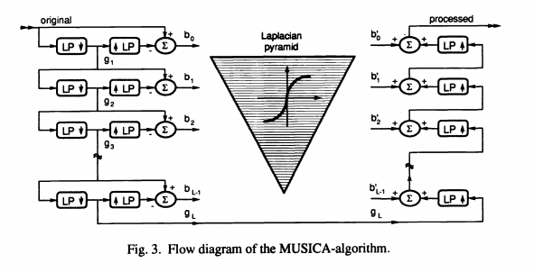
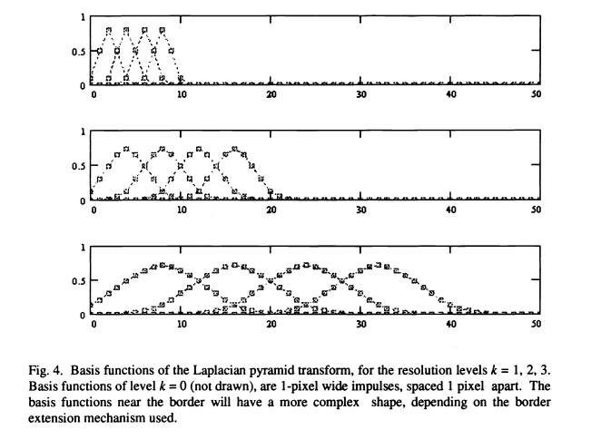

<h2/> 요약

​	해당 논문은 원본 이미지의 다중 해상도(mutiresolution) 표현에 기반한  Detail contrast 향상 문제에 대한 새로운 접근법을 제시한다.  이미지는 multiple scales에서 smooth, localised한 2차원 기저 함수의 가중 합으로 분해된다. 각 변환 계수는 특정 스케일과 특정 위치에서의 로컬 Detail을 나타낸다. Detail contrast는 변환 계수의 비선형 증폭에 의해 향상된다. 그런 다음 수정된 계수에 Inverse transform이 적용된다. 이는 artefacts 없이 균일하게 대비가 강화된 이미지를 산출한다. MUSICA 알고리즘은 다양한 방사선 영상에 적용되고 있고, 우수한 수용성을 가지고 있다. 이는 의료, 그래픽 및 산업 분야의 광법위한 응용 분야에 유용하다.

 

 

 

<h2/> 1. INTRODUCITON

​	Optimal contrast rendition은 전통적인 방사선학에서 중요한 문제이다. X-ray screen-film systems은 S자 그라데이션 곡선을 가지며, 노출 범위는 100:1이다. 선형 반응의 범위는 심지어 10배 더 작다. 노출 여유도는 대부분의 검사에서 작다. 노출이 적은(혹은 과다한) 영상은 밝은 영역과 어두운 영역에서 각각 대비가 0이다.  그라데이션 곡선에서 국소 기울기는 주어진 노출 수준에서 최소 감지 감소 차이를 결정한다. 이 곡선의 모양은 사용 가능한 동적 범위에 걸친 대비의 분포를 결정하기 때문에 매우 중요하다. 노출 범위에 대해서 한 쪽 부분에 대해 너무 관대하면, 다른 부분에서 부족할 수 있다. 정확한 노출 제어와 적절한 필름 그라데이션 선택은 기존 방사선 촬영에서 필수 요건이다.

 

​	CR 시스템은 단일 이미지 내에서 거의 1000:1로 스크린 필름 시스템보다 훨씬 큰 동적 범위를 수용하므로 정확한 노출 선량을 적용하는 문제는 기존 방사선 촬영보다 덜 중요하다. 하지만 동적 범위에 대한 영상 대비의 트레이드오프는 출력 단계에서 다시 나타난다.

 

​	CR 판독 시스템의 동적 범위는 모든 정보를 포착할 수 있을 만큼 충분히 크다. 하지만 이 전체 범위를 허용 가능한 대비로 표시할 수는 없다. 그런데 진단 관련 부분의 동적 범위는 감지된 범위보다 훨씬 작다. Pre-scan이 없는 시스템에서는 스캔한 데이터의 분석을 통해 관련 진단 범위가 결정되고, 선택한 하위 범위가 출력 매체의 전체 범위에 다시 매핑된다. 이 기능은 평균 영상 밝기가 노출 변동에 민감하지 않은 특정 한계 내에 있도록 합니다.

 

​	검사에서 진단 특징은 영상 전체에 걸쳐 광범위한 밀도 범위에서 나타난다. 이미지 그라데이셔만 최적화한다고 해서 모든 곳의 미세한 세부 사항에 대한 올바른 인식이 보장되는 것은 아니다. 대조도가 지각 임계값보다 낮을 수 있다.

 

​	세부 대비를 개선하기 위해 대부분의 접근법은 local neighbourhood operations을 기반으로 한다. Adaptive 히스토그램 균등화 및 unsharp 마스킹은 이 목적을 위한 기술이다. Adaptive 히스토그램 균등화는 부드러운 이미지에서 더 높은 공간 주파수 성분을 증폭시키는 경향이 있다. unsharp 마스킹은 이미지에서 더 높은 공간 주파수 성분을 증폭시키는 경향이 있다.  연산자 커널의 크기는 이러한 향상 기술이 활성화된 공간 주파수 대역을 결정한다.   

​	좋은 성능을 위해서는 커널 크기를 관심 Detail의 크기에 맞춰 조정해야 하지만, 가장 관련성이 높은 크기를 항상 미리 알 수 있는 것은 아니다. 또한 커널 크기를 특정 검사 유형에 적용할 수도 있지만, 진단 특징은 심지어 한 이미지 내에서도 서로 다른 스케일 수준에서 발생하기 때문에 결과가 만족스럽지 않을 수 있다.  

​	갑작스러운 신호 전환 근처에서 아티팩트를 생성할 수 있는데, 이는 없는 병변을 만들거나 있는 병변을 숨길 수도 있기 때문에 향상 기술의 많은 개선은 구체적으로 아티팩트의 억제를 다룬다.

 

​	여기서는 원본 이지미의 다중 해상도 표현에서 발생하는 세부 대비 향상 문제에 대한 새로운 접근법을 제시한다. 기본 아이디어는 이미지 평면과 모든 해상도 수준에 걸쳐 세부 진폭을 선택적으로 증폭하는 것이다.  

​	"Detail"이라는 용어는 이미지의 로컬 신호 차이를 나타낸다. Detail은 공간 영역에 국한되며, 제한된 공간 범위를 가지며, 본질적으로 미분 값인 특정 진폭을 갖는다.

​	공간적 범위가 작은(공간적 주파수가 높은) 신호 변화를 구분 없이, "high resolution(고해상도)", "small scale(소규모)", or "fine(미세)" details라고 한다.  광범위하게 확잔되는 신호 변화(저주파)를 "low resolution(저해상도)", "large scale(대규모)", "coarse(거친, 굵은)"라고 한다. 낮은 진폭의 detail을 "subtle(미세,미묘)"라고 한다.

   

<h2/> 2. THE MUSICA ALGORITHM

​	MUSICA 알고리즘에서 진폭이 낮은 이미지 구성요소는 높은 진폭 Detail에 상대적으로 증폭된다. 이는 기본적으로 특정 공간 주파수 대역을 강조하는 기존의 접근 방식과 근본적으로 다르다. 

​	MUSICA 알고리즘은 세 가지 기본 단계를 포함한다.

1. 원본 이미지를 모든 스케일에서 로컬 Detail을 나타내는 다중 해상도 피라미드로 분해한다.
2. 낮은 진폭 값을 강조하고, 큰 진폭을 줄이는 비선형 변환 함수에 따라 피라미드 값을 수정한다.
3. 수정된 Detail 피라미드에 the inverse of the decomposition operator를 적용하여, 대비가 향상된 이미지를 얻는다.

​	 

​	첫 번째 쟁점은 표현(representation) 선택에 관한 것이다. 모든 이미지는 선형 변환을 통해 2차원 기저 함수의 가중 합으로 표현될 수 있다. 현재 상황에서 중요한 몇 가지 변환 속성을 소개하기 위해 몇 가지 일반적인 예를 인용한다. (푸리에 변환(FT), 이산 코사인 변환(DCT), 하르 변환)

​	푸리에 변환은 아마도 가장 잘 알려진 선형 변환일 것이다. 해당 기저 함수는 직교, 주기적이며 전체 영상에 걸쳐 확장된다. 이미지 압축과 같은 이산 코사인 변환(DCT)의 일반적인 응용에서, 변환을 적용하기 전에 원본 이미지를 중복되지 않는 블록으로 분할하는 것이 일반적이다. 이 경우 기저 함수는 미리 결정된 크기의 영상 타일로 제한된다. 

​	세 번째 예인 하르 변환은 크기가 다른 비주기적 자기 유사 기저 함수 집합으로 특징지어진다. 8x8 이미지의 기저 함수는 그림 1에 나와있다. 왼쪽 상단 영상은 DC 값과 관련된 기저 함수이다. 세 개의 주변 부모 기저 함수는 전체 이미지를 포함하는 수직, 대각선 및 수평 단계를 나타낸다. 다른 모든 기저 함수는 더 큰 상위 기저 함수의 축척된 복사본이다. 각 항목은 특정 크기, 위치 및 방향의 로컬 계단식 세부 정보를 나타낸다. 원본 영상의 각 점은 크기와 방향이 동일한 각 그룹에서 정확하게 하나의 기저 함수로 처리된다. Haar 변환이 완료되면,  모든 이미지는 변환 계수로 정확하게 표현된다.

​	 

 

 

​	Detail 대비를 강화하는 것은 매우 미묘한 이미지 인식도를 높이는 것과 같다. MUSICA 알고리즘에 따르면,  Detail 대비는 변환 계수의 직접적인 조작에 의해 향상된다. 기저 함수는 우리가 개별 이미지 원시로 인식하는 것과 다소 일치한다고 암묵적으로 가정한다. 즉, 각 식별 가능한 원시 구성요소는 가중치가 0이 아닌 근소한 기저 함수로만 표현되어야 한다.  그런 다음 각 기저 함수는 특정 스케일과 영상의 특정 위치에서 정규화된 진폭의 세부 정보를 나타낸다. 기준 함수의 모양은 현재 대비 향상의 맥락에서 중요하지 않다. 그럼에도 불구하고, 일련의 최소한의 기준은 이전 단락의 관점에서 공식화될 수 있다. 첫째, 시각적 원시 요소는 국소적으로 나타나므로 기저 함수는 제한된 범위 내에서 0이 아닌 값을 갖는 공간 영역에서 국소화되어야 한다. 푸리에 변환과 같은 전역 변환은 기저 함수가 공간 영역에서 제대로 현지화되지 않았기 때문에 부적절하다.  둘째, 기저 함수는 모든 이미지에 다양한 크기의 원시 요소가 존재하므로 모든 척도를 포함해야 한다. DCT와 같은 블록 지향 변환의 경우는 그렇지 않다. 셋째, 원래 계수의 조작은 결과 이미지에 블록과 같은 아티팩트를 생성하기 때문에 Haar 함수와 같은 불연속적인 동작을 갖는 기저 함수는 허용되지 않는다. 

​	따라서, 적절한 표현(representation)은 제한된 공간적 범위를 가진 일련의 매끄러운 기저 함수들이 필요하며, 이는 전체 이미지 평면을 덮고 전체 공간 주파수 범위에 걸쳐 확장된다 (따라서 속성 "다중 해상도").
대략적으로 이미지는 양의 진폭 또는 음의 진폭을 가진 모든 크기의 블롭과 같은 세부 사항으로 추가적으로 구성된다고 생각할 수 있다.

 

​	다중 해상도 표현에 대한 최근의 많은 연구는 주로 이미지 압축 및 이미지 분할의 응용에 대한 이 연구 분야에 대한 관심이 증가하고 있음을 보여준다. 다양한 다중 스케일 분해 체계는 위의 요구 사항을 충족하며 Detail 대비 향상의 목적에 적합하다. 다음은 몇 가지 범주에 대해 간략하게 설명한다. 독자는 더 자세한 내용을 위해 기존 문헌을 참조한다.

 

​	하르 변환은 (직교) 파동 / ct 변환 클래스의 특수한 케이스로 볼 수 있다. wavelet 표현은 two-band splitting quadrature mirro filter (QMF) 조합의 계단식 적용에 의해 게산될 수 있다. 각 단계에서 저역 통과 필터 출력은  two에 의해 소멸되고 다음 분할 필터 쌍으로 공급된다.  신호 흐름은 그림 2에 스케치되어 있다. 

​	웨이블릿 표현은 모든 high-pass 응답과 최종 DC low-pass 출력으로 구성된다. 2차원에서 변환은 개별적으로 적용되어 각각의 특정 스케일에서 수평, 수직 및 대각선 Detail을 나타내는 하나의 low-pass와 세 개의 high-pass 배열을 생성한다. 

​	1-D 케이스와 마찬가지로 low-pass 구성요소만 다음 저해상도 단계로 공급된다. 변환 계수의 총 수는 원래의 샘플 수와 동일하다. wavelet 변환은 직교하기 때문에 정확한 reconstruction에 충분하다. Adelson 등은 빠른 계산을 위해 작은 홀수 크기의 필터 커널을 사용하여 거의 직교하는 QMF 구현을 수행했다.

 

 

​	직교성은 대비향상의 현재 컨텍스트 내에서 엄격한 요구사항이 아니다. 비직교 변환은 표현에서 일부 중복성을 희생하면서도 정확한 reconstruction을 제공할 수 있다. 잘 알려진 예로는 버트 등이 소개한 라플라시안 피라미드가 있다. 이 표현은 원본 이미지의 band-pass 이미지 시퀀스로 구성되며, 각 sub-band 이미지는 원래의 공간 주파수 스펙트럼의 약 1옥타브를 포함한다. 분해 및 재구성 과정은 그림3에 모식적으로 도식화되어 있다.

 

 

​	원본 영상은 low-pass 필터링 및 서브샘플링 된다. 이 이미지 g(1)은 다음으로 원본 배열 사이즈로 보간되고, 원본 이미지에서 픽셀 단위로 감산된다. 이 sub-band 이미지 b(0)는 라플라시안 피라미드의 최상위 레벨이다. 소멸된 low-pass 이미지 g(1)은 추가로 low-pass 필터링되고 서브샘플링되어 g(2)가 생성된다. 이것은 g(1)에서 보간되고 감산되어 두 번째 피라미드 레이어 b(1)이 된다. 

​	라플라시안 피라미드 b(k)의 모든 후속 레이어는 coarsest 피라미드 이미지 b(L-1)와 평균 이미지 값 g(L)이 얻어질 때까지 이전 반복의 서브샘플링 low-pass 이미지 g(k)에 이러한 작업을 반복하며 계산된다. 

​	reconstruction 과정의 흐름은 그림 3의 오른쪽에 그려졌다. 이미지 평균 g(L)은 다음으로 finer한 피라미드 레벨 b(L-1)의 배열 크기로 보간되고 픽셀 단위로 여기에 추가된다. 원본 해상도 수준에서 재구성된 영상을 얻을 때까지 보간 및 추가가 반복된다. decomposition과 reconstruction에 사용되는 보간 필터가 동일한 경우 reconstruction은 완전히 가역적이다. 

​	low-pass와 보간 필터는 둘 다,  0.05, 0.25, 0.4, 0.25, 0.05의 계수 값을 가지고 수평 및 수직 방향으로 따로 적용된다. 이러한 값을 사용하면 결과적인 2D 임펄스 응답은 거의 원형 대칭이며, 많은 반복 후 가우스 모양에 접근한다. 이러한 방식으로 각각의 라플라시안 피라미드 평면은 사실상 너비가 다른 두 개의 가우스 합성곱의 차이이다. 

​	다음 가우스 커널의 유효 width는 더 많은 계수를 포함하지 않고 각 반복에서 2배 증가한다. 이는 소멸 때문이다. 서브샘플링 후 앨리어싱을 방지하려면 low-pass 필터가 충분한 대역폭 감소를 제공해야 한다. 

​	라플라시안 피라미드 분해와 관련된 기저 함수는 각 피라미드 평면 내에서 동일한 크기의 가우시안이 중복된다.  몇 가지 기본 함수가 그림 4에 나와 있다. 해상도가 낮을 때마다 너비가 두 배가 된다. 이미지 경계 근처의 effective shapes는 더 복잡하고, 일정한 확장 또는 반사와 같이 사용되는 경계 확장 메커니즘에 따라 달라진다. 분명히 이러한 기저 함수는 부드럽고 공간적으로 국소화되어 있으며 여러 척도로 존재한다. 

 

 

